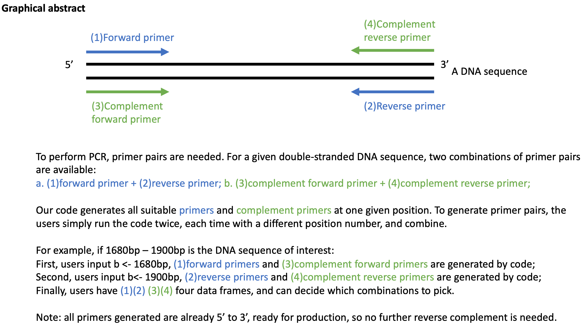

```{r setup, include=FALSE}
knitr::opts_chunk$set(echo = TRUE)
```
## 1.Why primer design is important:
Primer is needed for sequencing a DNA sequence, and primer pairs are needed for PCR. However, primer design sometimes can be time-consuming, because many factors need to be taken into consideration. If incorrect primers are used, sequencing or PCR can't proceed successfully, or even returns incorrect information. 

## 2.How the code works:

### Input (requires manual operation): 
1) a DNA sequence (the single strand DNA from a double strand DNA) arranged from 5’ to 3’ in a .txt file, not space, tab or comma separated and all upper case. 
2) the exact position where the primers are required, should be manually entered as “b” in the code.

### Output:
Two data frames: 1) all appropriate primers around position “b”, from 5’ to 3’; 2) all appropriate complement primers around position “b”, from 5’ to 3’;

### Example:
The user would like to amplify by PCR between 1680bp to 1900bp within the human TET2 gene. First, assign “b” as “1680” and run the code, the code gives out all primers and complement primers that can be used as forward primers; Second, assign “b” as “1900” and run the code, the code gives out all primers and complement primers that can be used as reverse primers. 


image: 

## 3.Dissection of each part of the code:

### Part I: (Chufan)
Import a DNA sequence, extract all possible primer_precursors and complement_primer_precursors with a length ranging from 18 to 24 bp. Note: this length range is long enough for adequate specificity and short enough for primers to bind easily to the template at the annealing temperature.

First, my code imports the .txt DNA file, and converts the DNA to a dataframe. After giving the value "b", the primer extraction can be started. 

```{r}

#set working directory to where the downloaded repository is
library(dplyr)
plasmid_sequence <-read.delim('data.human TET2 sequence single strand.txt', header = FALSE, stringsAsFactors = FALSE)

#assign value to b: b is the position in a gene where we want primers;
#here is an example: we want primers around 1680bp, so b=1680, and you can use any numbers

b <- 1680

plasmid_sequence <- strsplit(plasmid_sequence[1,1],"")
plasmid_sequence <- data.frame(plasmid_sequence[1], row.names = NULL, 
                             check.rows = FALSE, check.names = TRUE, 
                             fix.empty.names = TRUE, stringsAsFactors=FALSE)

```

Secondly, my code extracts all primer_precursors around position "b" with a length of 18bp to 24bp: print all nucleotides between position "b-18" to "b+18" (or other length).
All primers are in dataframe format. In the end, combine all the dataframes generated, and name it as "primer_precursors".

```{r}
#clean up raw data and convert to data frame format (from 5' to 3')

primer_precursor_producer <- function(a){
  primer_precursor <- NULL
  for (i in 0:a){
    primer_precursor <- rbind(primer_precursor, plasmid_sequence[(b-i):(b+a-i),], .id = NULL)}
    primer_precursor <- data.frame(primer_precursor, row.names = NULL, 
                                    check.rows = FALSE, check.names = TRUE, 
                                    fix.empty.names = TRUE, stringsAsFactors=FALSE)
  return(primer_precursor)
}

#combine all primers generated with a length range from 18bp to 22 bp

primer_precursors <- NULL
for (i in 17:23){
  primer_precursors <- bind_rows(primer_precursors, primer_precursor_producer(i))
}
```

Thirdly, complement the original DNA sequence, since DNA is double stranded. and extracts all possible complement primers as what previously did. Print out all primers and name it as "complement_primer_precursors".

```{r}
plasmid_sequence <- read.delim("data.human TET2 sequence single strand.txt", header = FALSE
                                          , stringsAsFactors = FALSE)
plasmid_sequence <- strsplit(plasmid_sequence[1,1],"")
plasmid_sequence <- paste(unlist(plasmid_sequence), collapse='')
complement_plasmid_sequence <- chartr("ATGC","TACG", plasmid_sequence)
complement_plasmid_sequence <- as.character(complement_plasmid_sequence)
complement_plasmid_sequence <- strsplit(complement_plasmid_sequence,"")
complement_plasmid_sequence <- data.frame(complement_plasmid_sequence[1], row.names = NULL, 
                               check.rows = FALSE, check.names = TRUE, 
                               fix.empty.names = TRUE, stringsAsFactors=FALSE)

complement_primer_precursor_producer <- function(a){
  complement_primer_precursor <- NULL
  for (i in 0:a){
   complement_primer_precursor <- rbind(complement_primer_precursor, 
                                            complement_plasmid_sequence[(b-i):(b+a-i),], .id = NULL)}
   complement_primer_precursor <- data.frame(complement_primer_precursor, row.names = NULL, 
                                               check.rows = FALSE, check.names = TRUE, 
                                               fix.empty.names = TRUE, stringsAsFactors=FALSE)
  
   #complement_primer_precursor <- complement_primer_precursor[ ,order(ncol(complement_primer_precursor):1)]
   #names(complement_primer_precursor) <- NULL
   return(complement_primer_precursor)
}

complement_primer_precursors <- NULL
for (i in 17:23){
  complement_primer_precursors <- bind_rows(complement_primer_precursors, complement_primer_precursor_producer(i))
}

```

To summarize, "primer_precursors" and "complement_primer_precursors" are generated, and further filter steps are in Part II and III.

### Part II: (Emma)
Keep precursors that have 40-60% GC content, and have a melting temperature (Tm) of 50-60°C. 

i.The guanine-cytosine (GC) content of a primer is the percentage of guanine and cytosine present in a DNA sequence. The GC            
content is calculated by: (Count(G+C)/(Count(A+C+T+G). The GC content is presented as a decimal, corresponding to a %. G-C base pairs, 
unlike A-T base pairs, have a unique triple hydrogen bond, which are harder to break, and can contribute to the overall stability of the primer. 
Additionally, primers with high GC content have higher melting temperatures. Therefore, it is common practice to design PCR primers to have a GC 
content within a range of 40-60%. This intermediate range ensures that the primers have sufficient stability without contributing 
to a high melting temperature. 


The input used to calculate the GC and Tm are the primer/complementary primer precursors generated in Part I mentioned above.In this example, we use the  primer_precursors dataframe as the input. This dataframe contains "NA"s due to the different lengths of the primers (from 18-24bp). To overcome this obstacle, it is recommended to change the "NA"s to "N"s. The functions used to calculate the GC, and later Tm, default to ignore N values. These functions default to ignoring "N" nucleotides as it is common in Sanger/other sequencing methods to output "N" when the nucleotide (A,C,T,G) cannot be discriminated. Using the package "TmCalculator", we will then fun the function "GC" over each row of the dataframe containing theprimer precursors. The apply function is used in this example to run the GC function (FUN=GC) over each row (MARGIN =1). The output is then a numeric vector corresponding to the GC content of these primers. We then add the numeric vector to the end of the primer_precursor data frame, labeling it as "GC Content". 

```{r}

library(seqinr)
library(TmCalculator)
#change NA to N
primer_precursors[is.na(primer_precursors)] <- "N"

#Calculate GC 
pp_GC <-apply(as.matrix(primer_precursors), MARGIN = 1, FUN = GC)

#add list to the end of the complement_primer_precursors df called "GC content"
primer_precursors["GC Content"] <- pp_GC
```

After calculating the GC content of every primer (found by row), the primers that are not within the range of 40-60 are filtered out, and a new list of the primers that meet this threshold is created. If the GC content is between >=40 or <= 60, the code will create a new dataframe called primer_precursors_pass_GC_threshold.This is done using the filter function in the dplyr library.

```{r}
#using dplyr , filter the primer_precursors that have a GC content between 40-60
library(dplyr)
primer_precursors_pass_GC_threshold <-filter(primer_precursors, primer_precursors$`GC Content` >= 40,primer_precursors$'GC Content' <= 60)
```

This workflow is then continued to include the complementary_primer_precursors dataframe.
   
   
ii.The melting temperature (Tm) of a primer is also a major factor in PCR efficiency. By definition, the melting temperature of a primer is the temperaturewherein 50% of the double-stranded DNA input is dissociated into single-stranded DNA. There are many ways to calculate the Tm, with factors such as GCcontent and length of primer effecting overall Tm. A common method is using the Wallace Method, which is calculated by the following equation: Tm = 4(G + C) + 2(A + T)=°C. However, this method is known to only be accurate for primers between 14-20bp and is biased towards shorter primers, as it takes into account total primer length in the calculation. A more accurate melting temperature can be calculated using the Nearest Neighbor thermodynamics.This method is considered to be more accurate than the Wallace Method and takes into consideration not only nucleotide content, but sequence as well. A version of this formula is seen here: 

  Tm = (($\Delta H$)/(A + $\Delta S$ + Rln(C/4)))-273.15 + 16.6log[Na+]
    
  In this equation $\Delta H$ is the enthalpy change (in kcal mol-1) during which the double-stranded DNA dissociates into sinlge-stranded DNA in the initial melt step. A is equal to -0.0108 kcal mol-1, which accounts for the helix initiation during this melt phase. $\Delta S$ involves the entropy change that occurs during the initial melt phase. R is the gas constant, measured at 0.00199 kcal mol-1. C is the oligonucleotide concentration that is usually standardized between 25-50nM, depending on the application. -273.15 is a conversion factor used to convert between Kelvin and C. Additionally, [NA+] is the sodium ion concentration, standardized around 50mM. The oligonucleotide concentration and [NA+] can be changed to fit the PCR reaction. Other factors, such as ions within the PCR reaction, can shift the Tm as well.
  
  Our code takes the primers that meet the GC threshold and computes the melting temperature for these primers using the Tm_NN (nearest neighbor) function found in 
the “Tm Calculator” package. Once the Tm_NN is calculated for each primer, by row, the primers that do not have a Tm between 50°-60°C are filtered out, similar to the GC-content workflow.

  It is important to note that Tm_NN contains default primer concentrations to 25nM and [NA+] to 50mM. The Tm_NN function can also accommodate applications that require other concentrations of primers, or different input concentrations of other ions associated in PCR reactions, such as Mg 2+ , which is defaulted to 0 mM. It is up to the user to change the default settings. 
  
  To calculate the Tm, we first create an empty vector (pp_pass_GC_threshold_Tm). Once this empty vector is created, the colon within the for loop  creates a sequence of numbers, and loops over i = 1, i= 2,etc. The for loop runs the function Tm_NN over each row of the  primer_precursors_pass_GC_threshold dataframe and creates a numeric vector containing the calcualted Tm values for that dataframe named pp_pass_GC_threshold_Tm.We then add the numeric vector to the end of the primer_precursors_pass_GC_threshold data frame, labeling it as "Tm". 
  
```{r}

pp_pass_GC_threshold_Tm <- c()
for (i in 1:nrow(primer_precursors_pass_GC_threshold)){
  pp_pass_GC_threshold_Tm <- c(pp_pass_GC_threshold_Tm, Tm_NN(as.matrix(c2s(primer_precursors_pass_GC_threshold[i,]))))
}

#add list to the end of the complement_primer_precursors_pass_GC_threshold called "Tm"
primer_precursors_pass_GC_threshold["Tm"] <-pp_pass_GC_threshold_Tm

```

As previously mentioned, high GC content can contribute to a high melting temperature, as a higher melting temperature is needed to break the triple hydrogen bond present between the G-C base pair. Therefore, it is commonly recommended that the primer Tm is between 50°-60°C. Melting temperatures above this range can increase the probability of secondary annealing. 

Our next step is to filter the melting temperatures that are within 50°-60°C. To do this, we add the vector containing the Tm, pp_24bp_pass_GC_threshold_Tm, and add it to the pp_24bp_pass_GC_threshold dataframe using the cbind function. We then rename that column "Tm". In this case, this was the 26th row (#bp +2), but this will change for bp of other sizes.

To filter, we use the filter function within dplyr, similar to what was used to filter the GC content. This function is used to filter the melting temperatures of the primers that are between 50°-60°C. The primers that have a melting temperature within this range are filtered into a dataframe labeled primer_precursors_pass_GC_and_Tm_threshold.
  
```{r}
#filter out the Tm that are not within 50-60 degrees
library(dplyr)

#filter out Tm that is not between 50-60
primer_precursors_pass_GC_and_Tm_threshold <-filter(primer_precursors_pass_GC_threshold, primer_precursors_pass_GC_threshold$Tm >= 50, primer_precursors_pass_GC_threshold$Tm <=60)


```

This process is also repeated for all complementary primer precursors. The output of the expanded code should include primers precursors and complementary primer precursors that have a GC content betwwen 40-60 and a melting temperature 50°-60°C. Once both forward and reverse primers are designed (see Part I) it is recommended that forward and reverse primers be within 5° of each other to ensure that the PCR reaction occurs efficiently on both sides of the gene of interest.

### Part III: (Ange)
Get rid of precursors that don’t start or end with ½ G/C. 
The goal of my code is to generate primers and complement primers that begin and end with a G or a C. The importance of designing a primer that has G and C bases at the beginning ( 3’ end ) and end (5’ end ) is to ensure the correct binding at the 3’ and 5’ ends due to the stronger hydrogen bonding that exists between G and C. This overall contributes to higher stability through increased melting temperature of the primer and template than it would if the primer started and ended with AT bonds. 

From the example in part 2, I am including a code for the primer and complement precursor with 24 base pairs. The full code is shown Rstudio. In my code, I loaded tidyverse package which contains central data structures for use later in the code. Next, I generate a list of all primer precursors from Emma’s code that generates primers that meet the G/C content and melting temperature threshold. From that list, I exclude the first column of every primer precursor that begin with A or T and I do the same for the last column of every primer precursor. This in the end, generates another list of good primer precursors which begin and end with G/C pairs.

```{r}
#######################################
#Ange's code: Finding primers and complement primer strands that begin with G/C pairs 
########################################
library(tidyverse)

#in the full code, this list is made with all primers 
Allprimerprecursors<-list(pp_24bp_pass_GC_and_Tm_threshold[,c(-ncol(pp_24bp_pass_GC_and_Tm_threshold) + 1, -ncol(pp_24bp_pass_GC_and_Tm_threshold))])


list_of_good_primer_precursors <- list()
for(file in Allprimerprecursors){
  whichcol <-1
  Lastcall <- file[ ,whichcol]
  NotAorT<- !(Lastcall %in% c("A","T"))
  file <-file[NotAorT, ]
  
  
  whichcol <-ncol(file)
  Lastcall <- file[ ,whichcol]
  NotAorT<- !(Lastcall %in% c("A","T"))
  file <-file[NotAorT, ]
  list_of_good_primer_precursors[[ncol(file) - 17]] <- file
  
}
```

Now that we have the final primers, we just need to format the final output and can print it in a table

```{r}
good_primer_precursors <- bind_rows(list_of_good_primer_precursors)

final_list_of_forward_primers <- good_primer_precursors %>% 
  unite("Primer", X1:X24, na.rm = TRUE, sep = "")


knitr::kable(final_list_of_forward_primers)
```

In the full R code,I used tibble from tidyverse to get the complement sequence based off the forward sequence (change A to T, etc.). Next, I reversed the complement sequence so that it too is written from 5' to 3'. Finally, my code unites and prints a final list of primer and complement primer precursors that begin and end with G/C pairs. 


## 4.Strengths of our code:
If sending primers to be produced by companies, primers are required to be from 5' to 3'. All primers generated from our code are from 5’ to 3’, so no further reverse complement is needed.

## 5.Shortages of our code:

  Whether the primers are self or double complemented hasn’t been tested. Primer pairs should have a Tm within 5°C of each other. Make sure there are no highly repetitive sequences. You can look at primer pairs and filter out those that have >4 repeats. 
Primer pairs should not have complementary regions. Primer pairs should have a Tm within 5°C of each other.(Need to explain why-I note why we cant have the primers have complementary regions below)

   Our code does not cover another essential aspect of PCR primer design, which involves primers that do not self-anneal, forming primer-primer interactions, alternatively called primer dimers. This step should
be done after designing both forward and reverse primers. Primer dimers can form due to complementary bases in the sequences, thus leading to off-target amplification and inhibiting the amplification of the 
DNA target sequence. While we note that primers should not have complementary regions, our code does not contain an algorithm that correctly predicts primer dimers. Many currently available programs caclulate
and incorporate the Gibbs free energy ($\Delta G$) of association in determining primer-dimer formation ( a $\Delta G$ of around (-5) to (-6) is standard, but is largely application based). Therefore, to 
overcome this shortcoming, we recommend either using software, such as the OligoAnalyzer Tool by IDT, or the PrimerRoc algorithm developed by Johnson et al.(2019) to determine the presence of primer dimers
once both forward and reverse strands are designed.  


```{r}
